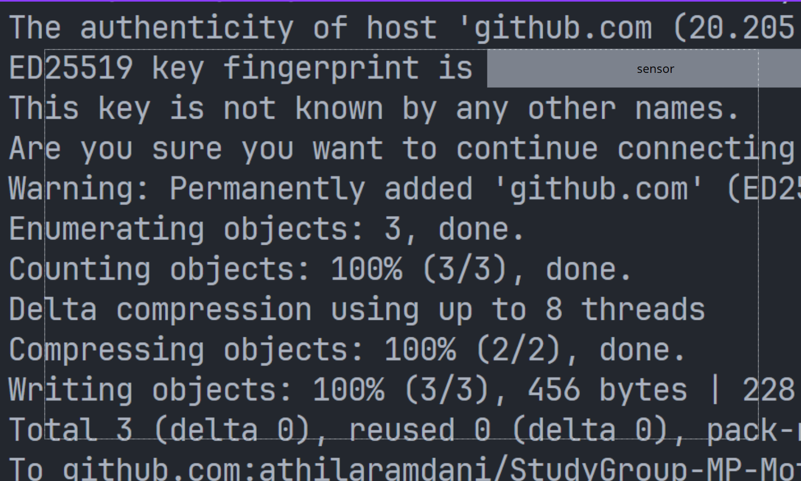

# **Study Group MP - Week 1**  
**Athila Ramdani Saputra**  
**NIM: 103012300132**  

---
## Rangkuman Week 1: Version Control Git
Pada pertemuan pertama Study Group dengan pemateri mas Zayid dan juga pada aslab serta rekan2 intern, kita membahas dasar-dasar Version Control menggunakan Git diantaranya :
1. **Membuat Akun Git**
- Para intern yang masih belum membuat akun github diajarkan bagaimana cara membuat akun github dengan cara mendaftarkan email dan membuat password
2. **Membuat Repository**
- selanjutnya diberikan cara cara untuk pembuatan repo yaitu
### Membuat Repository Melalui Website GitHub
Buka GitHub -> Klik tombol "+" di kanan atas -> Pilih "New repository" -> Isi nama repository dan pengaturan lainnya -> Klik "Create repository"
### Membuat Repository Lokal dan Menghubungkannya ke GitHub
Buka Terminal/GitBash (sesuaikan dengan folder), lalu lakukan command ini
| **Perintah**                      | **Fungsi**                                                                                                   |
|------------------------------------|-------------------------------------------------------------------------------------------------------------|
| `git init`                         | Menginisialisasi repository Git lokal di folder yang dipilih.                                               |
| `git add .`                        | Menambahkan semua file yang ada di folder ke staging area.                                                  |
| `git commit -m "komentarnya"`      | Menyimpan perubahan yang ada di staging area ke repository lokal dengan pesan commit.                       |
| `git branch -M main`               | Mengubah nama branch default menjadi `main`.                                                                |
| `git remote add origin <url>`      | Menghubungkan repository lokal ke repository GitHub melalui URL (HTTPS/SSH).                                |
| `git push origin main`             | Mengunggah commit dari branch `main` lokal ke repository `main` di GitHub.                                  |

### **Up Repo Memakai SSH**

Alur dalam up repo memakai SSH adalah sebagai berikut:  

| **Langkah**                          | **Perintah/Proses**                                                                                                     |
|--------------------------------------|-------------------------------------------------------------------------------------------------------------------------|
| Membuat SSH Key                      | Jalankan perintah: `ssh-keygen -t ed25519 -C "emailsaya@gmail.com"`.                                                    |
| Menyalin SSH Key                     | Gunakan perintah: `clip < ~/.ssh/id_ed25519.pub`.                                                                      |
| Menambahkan Key ke GitHub            | Masukkan key yang telah disalin ke **Profile > Settings > SSH and GPG Keys > New SSH Key**.                             |
| Mengisi Title dan Key                | Beri judul pada key dan paste key yang disalin dari langkah sebelumnya.                                                 |
| Gunakan Alur di poin membuat repository lokal | ikuti alur nya dan setelah di push muncul gambar seperti di bawah tabel. |
| Fungsi SSH                           | Berguna untuk menghubungkan GitHub dengan komputer lokal secara aman.  |

Berikut adalah contoh gambar ilustrasi:  

